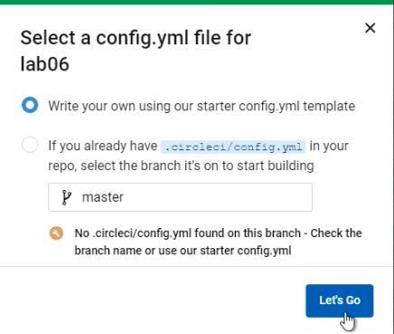
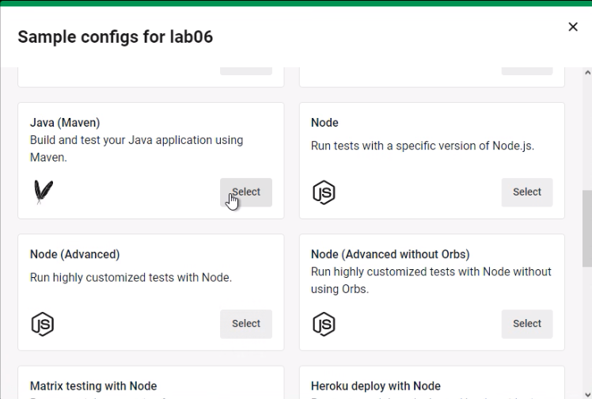
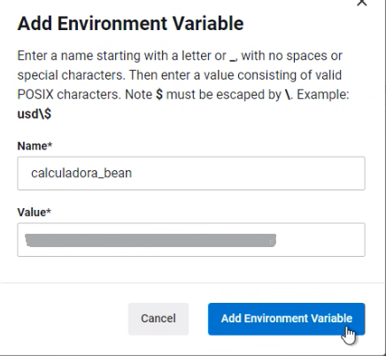

# LABORATORIO 6
__Camilo Andrés Pichimata Cárdenas__   

__Zuly Valentina Vargas Ramirez__

# PARTE I. INTEGRACIÓN CONTINUA

### Agregando Proyectos a CircleCI

- Realizando las configuraciones iniciales

  

