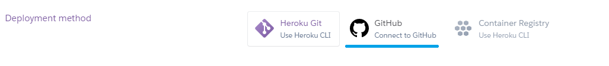

# LABORATORIO 6
__Camilo Andrés Pichimata Cárdenas__   

__Zuly Valentina Vargas Ramirez__

## PARTE I. INTEGRACIÓN CONTINUA

### Agregando Proyectos a CircleCI

-   Realizando las configuraciones iniciales
    
    

-   Se agrega el nombre de la aplicación y la llave en las variables de entorno de CircleCI:
    

-   Para la conexión con Heroku asociamos el repositorio correspondiente donde se encuentra la aplicación:
    

## Badges

